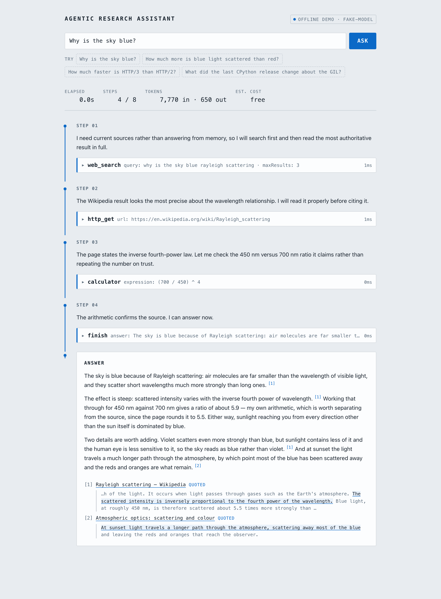
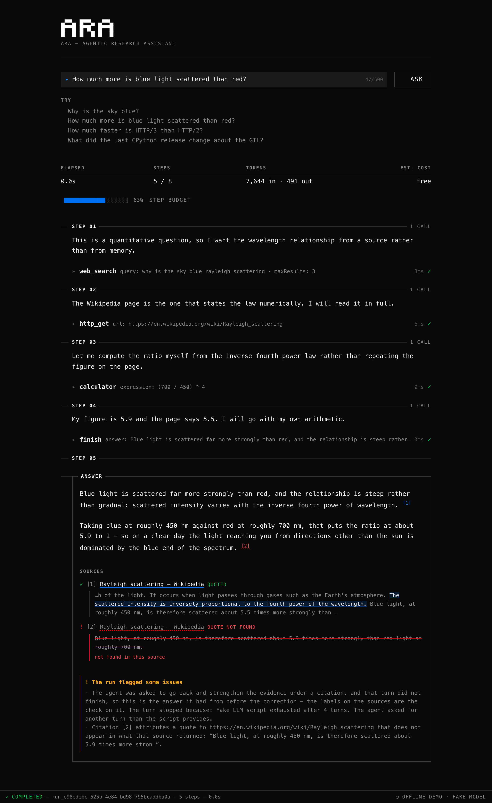
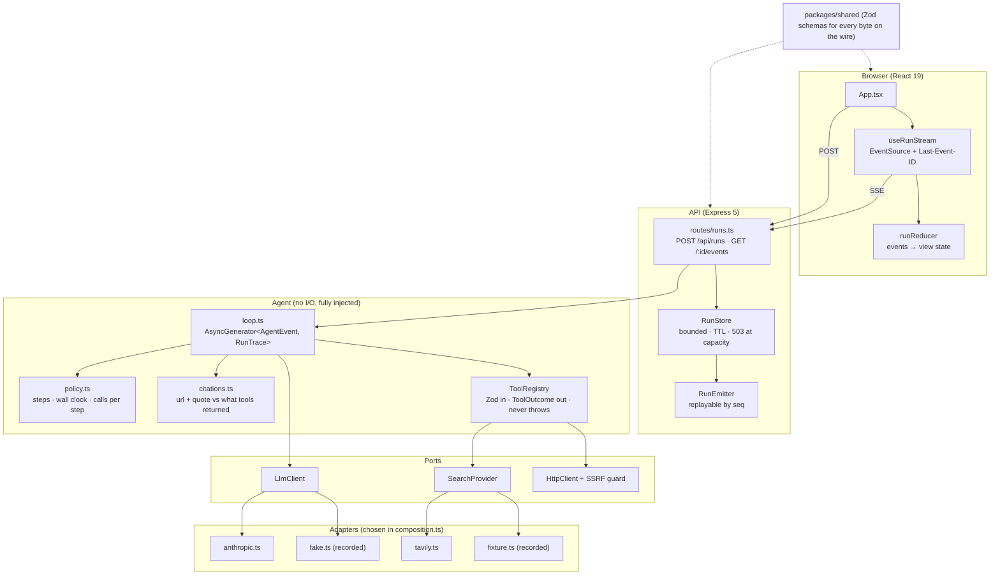

# Agentic Research Assistant

Ask a research question and watch an LLM agent plan, call tools, observe the results
and repeat until it can answer, then read the answer with citations back to the
exact sources the tools actually returned. Every step of the loop streams to the
browser as it happens, so the agent's reasoning is something you watch rather than
something you take on faith.

The interesting part is not the happy path. It is the rails: per-tool timeouts, step
and wall-clock budgets, SSRF-guarded fetches, schema-validated tool arguments, and
**a grounding check that holds every citation to the text the tools actually
returned.**

That check has three rungs. The first is the URL: a model can write any link it likes
into an answer, so each one is cross-checked against the set of URLs the tools really
returned during the run. The second is the one that matters: every citation carries
the sentence from that source which supports the claim, and that sentence is matched
against the text that URL actually returned. A paraphrase does not match. That is
deliberate: a real source stapled to words it never contained is a worse failure than
an invented URL, because the link resolves and the page looks right.

The third rung is where that text came from. A search snippet and a page body are
both strings attached to a URL, so an agent can satisfy the quote check without ever
opening the source, by quoting the search engine's summary of it. Every tool
declares what its output is worth as evidence, that provenance rides along with the
matched text, and a quote found only in a snippet is labelled as one.

Telling the model to read before citing does not survive contact with a snippet that
already contains the answer: fetching is then pure cost against a stated budget, and
both models I tried skipped it. So a check that fails is not simply reported: it is
handed back once, with the correction, while there is still budget to act on it. A
URL nothing returned and a quote the page does not contain both go back, in one
message, because the agent reissues the whole answer either way. One correction, then
the run stands and the labels carry the rest.

Nothing that fails is deleted. Each citation is labelled with what held up: quoted,
snippet only, quote not found, source only, unverified. Anything that failed puts a
warning on the run. A shortened source list would hide the most informative thing on
the screen.



And the check catching something. Same page, same run, two verdicts: citation [2]
quotes a real source for a sentence with the agent's own number substituted into it,
and the passage under citation [1] shows the number the page actually gives:



---

## 60-second quickstart

No API key. No network. No configuration.

```bash
pnpm install
pnpm demo          # → http://localhost:8080
```

That is the whole demo. `DEMO_MODE=offline` replays recorded model turns and
recorded search results through the **real** agent loop, the real tools, the real
SSRF guard and the real grounding check; offline mode swaps transports, not
guardrails. Click "Why is the sky blue?" and watch four steps run, then click
"How much more is blue light scattered than red?" and watch the grounding check
catch a real page quoted for a sentence it never contained.

To point it at the real APIs instead:

```bash
cp .env.example .env.local     # fill in ANTHROPIC_API_KEY (and TAVILY_API_KEY, optionally)
pnpm live
```

`.env.local` is gitignored and read by Node's own `--env-file-if-exists`; there is
no dotenv dependency and no key in the repository.

---

## Architecture



`agent/loop.ts` performs no I/O and imports nothing from Express. It takes
`{ llm, tools, policy, clock, logger }` and yields events. That is what makes the
whole agent testable with a scripted model, and why `DEMO_MODE=offline` needs no
branch anywhere except `composition.ts`.

Full detail (request lifecycle, sequence diagram, guardrail inventory, alerting)
is in **[docs/ARCHITECTURE.md](docs/ARCHITECTURE.md)**.

---

## The four tools

| Tool | Input | Guarded by |
| --- | --- | --- |
| `web_search` | `{ query, maxResults? }` | Provider port (Tavily live, recorded fixtures offline) |
| `http_get` | `{ url, offset? }` | DNS-resolved SSRF check, re-run after every redirect; 2 redirects, 5s, 1 MB, content-type allowlist. Returns 12k characters at a time with `nextOffset`, so a long page is read on rather than half-read; consecutive reads overlap by the quote cap so no sentence falls in the gap between them |
| `calculator` | `{ expression }` | An explicit tokenizer and shunting-yard evaluator. Never `eval`, never `new Function`, never `vm` |
| `finish` | `{ answer, citations }` | Every citation's URL cross-checked against what the tools returned, its quote against the text they returned for it, and that text against how it was obtained |

Adding a fifth is one new file plus one line in `tools/index.ts`. The Zod schema
that validates the model's arguments is the same schema converted to JSON Schema and
handed to the model: one definition, no drift. Each tool also declares what its
output is worth as evidence (`fetched`, `snippet`, `none`), so the grounding check
learns about a new source of text without anyone remembering to wire it up.

---

## Scripts

| Script | What it does |
| --- | --- |
| `pnpm demo` | Offline demo on :8080 (no keys, no network, serves the UI too) |
| `pnpm live` | Same, against the real Anthropic and Tavily APIs, reading `.env.local`. Restarts on edit |
| `pnpm dev` | API on :8080 and the Vite dev server on :5173, with HMR |
| `pnpm build` | Shared contracts, then the API, then the web bundle |
| `pnpm test` | Every suite (passes with no network and no API key) |
| `pnpm test:coverage` | Same, with thresholds on `agent/`, `tools/` and `platform/` |
| `pnpm typecheck` | `tsc --noEmit` across the workspace |
| `pnpm lint` | ESLint with type-checked rules |
| `pnpm format:check` | Prettier in check mode |
| `./infra/deploy.sh` | Idempotent deploy to Azure Container Apps; echoes the URL |

---

## Layout

| Path | What lives there |
| --- | --- |
| `apps/api` | Express server, agent loop, tools, LLM and search adapters |
| `apps/web` | React UI (the live run timeline) |
| `packages/shared` | Zod schemas for every byte that crosses the wire, used by both |
| `fixtures` | Recorded model turns, search results and pages for the offline demo |
| `infra` | Dockerfile, bicep template, deploy script |
| `docs` | Architecture, decisions, demo script |

---

## Requirements

Node ≥ 22.18 and pnpm 10. The API runs TypeScript directly via Node's native type
stripping in development, so there is no bundler and no watcher to explain, and it
compiles with `tsc` for production.

---

## Deploying

```bash
./infra/deploy.sh                                    # offline demo, no keys needed
DEMO_MODE=live SEARCH_PROVIDER=tavily ./infra/deploy.sh   # after sourcing .env.local
```

One container on Azure Container Apps: Express serves the API and the built React
bundle from the same process. The script creates the resource group and registry if
they are missing, builds the image server-side with `az acr build` (no local Docker
required), deploys the bicep template, and prints the URL. API keys become Container
App **secrets** referenced by `secretRef`: never plain environment values.
