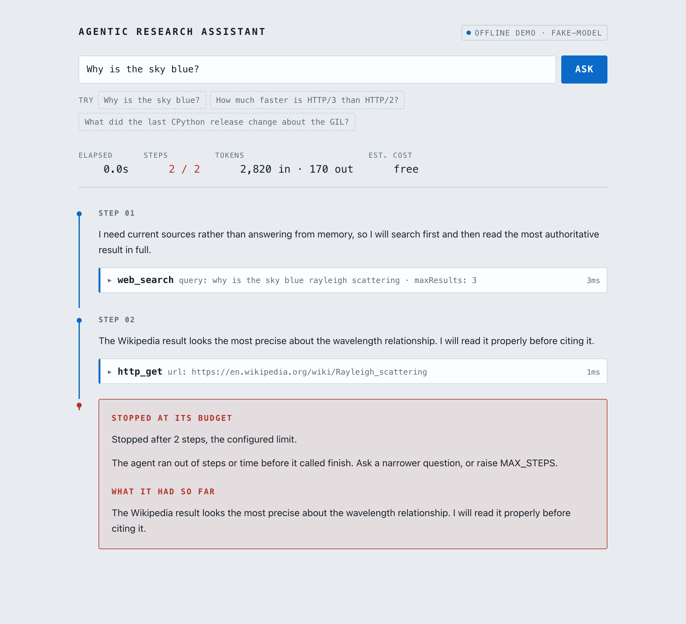

# Demo script

Five minutes, offline, no keys. What to click, what to say, in order — including one
deliberate failure, because a guardrail nobody has seen fire is a claim rather than a
feature.

**Before you start**

```bash
pnpm install && pnpm demo     # → http://localhost:8080
```

Have a second terminal open. Leave it on the repo root.

---

## 0:00 — What this is (30 seconds)

> "A research agent. You ask a question, it plans, calls tools, reads what comes
> back, and repeats until it can answer. What I care about is the second half: you
> can watch every step, and every citation in the answer is checked against the URLs
> the tools actually returned."

Point at the badge in the top right: **OFFLINE DEMO · FAKE-MODEL**.

> "This is running with no network and no API key. Recorded model turns and recorded
> search results, through the real loop, the real tools, the real SSRF guard and the
> real citation check. Offline mode swaps transports, not guardrails."

---

## 0:30 — One run, start to finish (90 seconds)

Click the **"Why is the sky blue?"** chip. Let it play. Do not narrate over it —
watch it with them for a beat, then walk back through what happened.

Four steps appear on the timeline:

| Step | The model's reasoning | The tool |
| --- | --- | --- |
| 01 | "I need current sources rather than answering from memory" | `web_search` |
| 02 | "The Wikipedia result looks the most precise…" | `http_get` |
| 03 | "Let me check the 450 nm versus 700 nm ratio it claims rather than repeating the number on trust" | `calculator` |
| 04 | "The arithmetic confirms the source. I can answer now." | `finish` |

> "Search, read, verify the arithmetic, answer. Step three is the one I like — it
> read a claim in a source and checked it instead of copying it."

Expand the `web_search` call. Show the arguments and the raw result.

> "Arguments and results, exactly as they crossed the boundary. Nothing here is a
> summary of what happened — it *is* what happened."

Point at the counters: elapsed, **steps 4 / 8**, tokens in and out, estimated cost.

> "Four of eight. Eight is the ceiling, not a target — the budget is what stops an
> agent that has decided to keep going."

---

## 2:00 — The citations (60 seconds)

Scroll to the answer. Point at a `[1]`, then at the source list at the bottom.

> "Two sources, both linked. Here is the part I would want to be asked about: the
> model can write any URL it likes into that answer. Before the answer is shown,
> every citation URL is checked against the set of URLs that tools actually returned
> during this run. Anything that fails is stripped out and the run carries a warning
> saying so."

Then, the sentence that makes it land:

> "That is why `finish` is a tool call and not free text. The answer arrives as
> validated structured data, so the citation list is an array I can check. If the
> answer were prose, I would be regex-scraping URLs out of it and trusting what I
> found."

Open `agent/citations.ts` if they want to see it — it is short enough to read aloud.

---

## 3:00 — The deliberate failure (90 seconds)

This is the important part of the demo. In the second terminal:

```bash
# Ctrl-C the demo, then:
MAX_STEPS=2 pnpm demo
```

Ask **"Why is the sky blue?"** again. It is the same recorded run, which needs four
steps and now has two.

The run stops after step 02. The step counter turns red — **2 / 2** — and the
timeline ends in a failure panel rather than an answer.



> "'Stopped at its budget. Stopped after 2 steps, the configured limit.' It did not
> crash, it did not hang, and it did not throw an unhandled rejection into a log
> somewhere — and look at the last section: *what it had so far*. The budget is
> checked **before** each step rather than after, so the run ends before spending
> another model call, and it ends holding whatever it had. That is the difference
> between a partial answer and a stack trace."

Worth pointing at the panel's tone while it is on screen: it explains the reason, it
says what to do about it, and it is not styled as a crash. A budget stop is the rails
working, and the UI should look like it.

Show `agent/policy.ts`:

> "Every rail in one object: steps, wall clock, tool calls per step, output tokens,
> and how many times a model that answers in prose gets told to use `finish`. When
> someone asks what stops an agent looping forever, I would rather point at a file
> than tell a story."

If there is time, the second guardrail is a one-liner in the same terminal:

```bash
for i in $(seq 1 12); do
  curl -s -o /dev/null -w '%{http_code} ' -X POST localhost:8080/api/runs \
    -H 'content-type: application/json' -d '{"query":"rate limit probe please"}'
done
```

```
202 202 202 202 202 202 202 202 202 202 429 429
```

```json
{
  "type": "/problems/rate-limited",
  "title": "Too many runs.",
  "status": 429,
  "detail": "You can start 10 runs per minute. Wait 43s and try again.",
  "instance": "/api/runs"
}
```

> "RFC 9457 problem+json, from one error handler, with a `Retry-After` header. Every
> error in this app has that shape — there is no route in the codebase containing a
> try/catch."

Restart the normal demo (`pnpm demo`) before moving on.

---

## 4:30 — Close (30 seconds)

> "What I would do next, in order: move the run store to Redis so it survives more
> than one replica, stream the model's tokens instead of whole turns, and persist
> traces so the same twenty questions can be replayed against a new prompt and
> diffed. The rest is in the README — including what I deliberately left out."

---

# Q&A

The questions this project exists to be asked.

### How do you stop infinite loops?

Four limits, all in `agent/policy.ts`, all checked before a step rather than after.
`maxSteps` (8) and `maxWallClockMs` (60s) bound the run. `maxToolCallsPerStep` (3)
bounds one turn. And a model that answers in prose instead of calling `finish` gets
exactly one nudge — a second failure ends the run as `no_tool_call` rather than
trying a third time.

Checking before the step is the detail that matters: the run ends holding whatever it
had, so a budget failure produces a partial answer and a reason, never an exception.

### What happens when the model hallucinates a citation?

Every tool result's URLs are collected as the run goes. When `finish` arrives,
`agent/citations.ts` cross-checks each citation URL against that set. Anything not in
it is stripped from the answer and recorded as a warning on the trace, which the UI
renders as a dashed, flagged source rather than a link.

The check works because `finish` is a validated tool call. The citations are an
array of `{ id, url, title }` that Zod has already parsed — not a regex over prose.

Worth saying plainly: this catches a *fabricated source*. It does not catch a real
source being misread, and no amount of URL checking would. That needs an eval set,
which is on the "what I'd do next" list.

### Why Zod and not hand-written JSON Schema?

Because two definitions drift, and the drift is silent. The schema that validates the
model's arguments is the same object converted with `z.toJSONSchema()` and handed to
the model as its tool spec. One definition, one source of truth, and the TypeScript
type is inferred from it rather than written beside it.

Hand-written JSON Schema means the model is told about a field the validator does not
accept, and you find out from a confused model at runtime.

### How do you test something non-deterministic?

By moving the non-determinism behind a port. `LlmClient` is an interface; `llm/fake.ts`
replays a scripted array of responses. The agent loop performs no I/O and takes
`{ llm, tools, policy, clock, logger }` as arguments, so a test drives a full run with
a scripted model, a fake clock, and no network — and asserts the exact event sequence.

Three layers, deliberately:

1. **Deterministic scenarios** for the loop's mechanics: a happy path, a bad tool
   call the model recovers from, a budget stop, a hallucinated citation, a tool
   timeout, prose-with-no-tool-call.
2. **Wire-shape tests** for the real adapters, using msw to serve recorded Anthropic
   and Tavily responses to the real Axios client. These catch "the vendor renamed a
   field", which is the only thing that actually breaks an adapter.
3. **The offline demo itself**, asserted end to end through Supertest.

What none of that tests is whether the agent is *good*. That is an eval problem, not
a unit test problem, and pretending otherwise is how people end up with a green suite
and a bad agent.

### What breaks at 100 concurrent users?

The run store, first and hardest. Runs live in one process's memory in a bounded map
with a TTL, and `POST /api/runs` returns 503 at capacity rather than growing without
bound — so the app sheds load instead of falling over, but it does shed it.

In order:

1. **State.** One replica holds a run; the browser subscribes in a second request.
   Today that is handled with sticky sessions and a two-replica cap, which is a
   workaround. Redis behind the existing `RunStore` interface removes it.
2. **Provider rate limits.** 100 concurrent runs is ~800 model calls in a minute.
   The retry logic honours `Retry-After`, so it degrades rather than breaks, but a
   queue and a token budget per user become real requirements.
3. **Cost.** At list price, a few cents a run — 100 concurrent users is a number
   someone should have approved. `llm_tokens_total` and the per-run cost line exist
   so that conversation has data in it.
4. **Memory.** Traces hold every tool result verbatim. A 1 MB `http_get` response
   times 100 runs is not nothing, which is why `http_get` caps at 1 MB by streaming
   and aborting.

Note what is *not* on that list: the event stream. SSE over one connection per
viewer is cheap, and the emitter replays by sequence number, so a reconnect costs a
replay rather than a rerun.

### How would you add a new tool?

One file plus one line.

```ts
// apps/api/src/tools/weather.ts
export function createWeatherTool(deps: WeatherDeps): Tool<Input, Output> {
  return {
    name: 'get_weather',
    description: 'Current conditions for a city. Written for the model, not for a human.',
    inputSchema: InputSchema,     // the same schema the model is given as JSON Schema
    outputSchema: OutputSchema,
    timeoutMs: 3_000,
    execute: async (input, ctx) => { /* … */ },
  };
}
```

```diff
  // apps/api/src/tools/index.ts
  const tools = [
    createWebSearchTool(deps),
    createHttpGetTool(deps),
    createCalculatorTool(),
+   createWeatherTool(deps),
    createFinishTool(),
  ];
```

Everything else follows: the registry converts the schema to the model's tool spec,
validates arguments before any side effect, enforces `timeoutMs`, parses the result,
and returns a `ToolOutcome` that never throws. The UI needs no change — it renders
tool calls generically. Metrics need no change — they are labelled by tool name.

That the diff is one file plus one line is the whole point of the `Tool` interface.
If adding a tool touched the loop, the loop would be the wrong shape.
